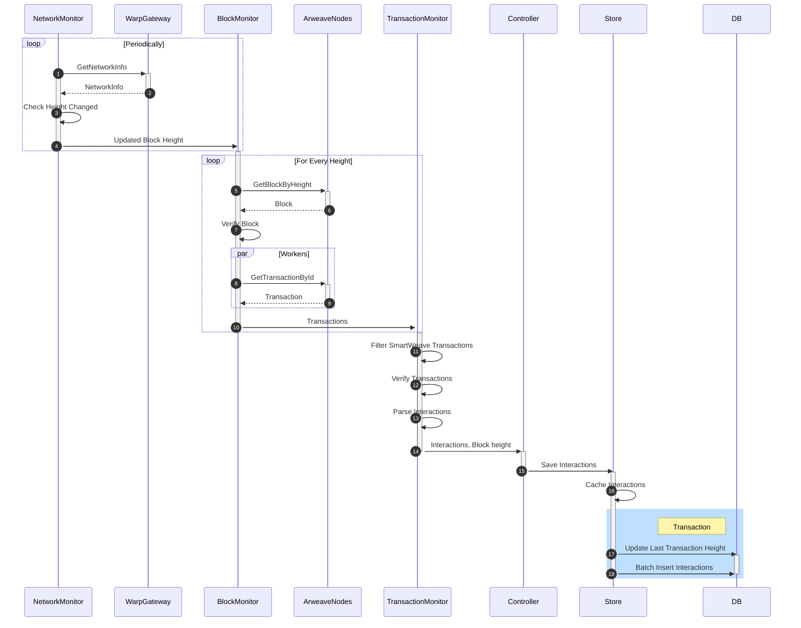

# Syncer

Service for syncing with Arweave nodes. It downloads all transaction from Arweve, filters for SmarWeave contracts, parses and saves interactions to the database.

## Architecture




## Build
We use Make for build orchestration. To generate binaries simply use `make` in the root directory

### Local development
Seting up a local dev environment for the first time:
```sh
# Start all needed services
docker-compose up -d 

# Dump the database (only schema is needed) and save it locally
pg_dump -h ... -U ... ... | gzip > gateway_dump.gz
gunzip gateway_dump.gz
psql -U postgres -h 127.0.0.1 -p 7654 -d warp < gateway_dump

# Build and launch syncer
make run
```

### Docker
To speed up the build we're using a `vendor` dir during the build. To make it easier we added commands to the Makefile

```sh
# Build container and tag it warp.cc/syncer:latest
make docker-build

# Run container (builds it before)
make docker-run

```


## Configuration

Syncer has a default configuration that works in local development (*src/utils/config)*. To overwrite it you can a json configuration file or ENV variables:


| Environment Variable | Description |
|---|---|
| SYNCER_DBPORT | Postgres DB port |
| SYNCER_DBHOST | Postgres DB host address |
| SYNCER_DBUSER | Postgres DB user |
| SYNCER_DBPASSWORD | Postgres DB password |
| SYNCER_DBNAME | Postgres DB name |
| SYNCER_DBSSLMODE | Is SSL enabled to connect the database.  Possible values: enabled or disableds |
| SYNCER_DBPINGTIMEOUT | How much time can PING to the db take before it's considered a failure |
| SYNCER_LOGLEVEL | Log level. Possible values: trace, debug, info, warn, error |
| SYNCER_ARNODEURL | Arweave node URL |
| SYNCER_ARSTABLEDISTANCE | Blockchain depth considered to be stable. Only stable blocks are saved to the DB. |
| SYNCER_LISTENERQUEUESIZE | Number of blocks cached before listener stops downloading new ones |
| SYNCER_STOREBATCHSIZE | Minimal number of interactions that trigger an insert to the db |
| SYNCER_STOREMAXTIMEINQUEUE | Maximal time interactions wait to be inserted.  After this time insert is forced. Example values: 400ms, 1s, 1m  |
| SYNCER_STOREMAXTIMEBETWEENRECONNECTS | How often to retry establishing DB connection |


